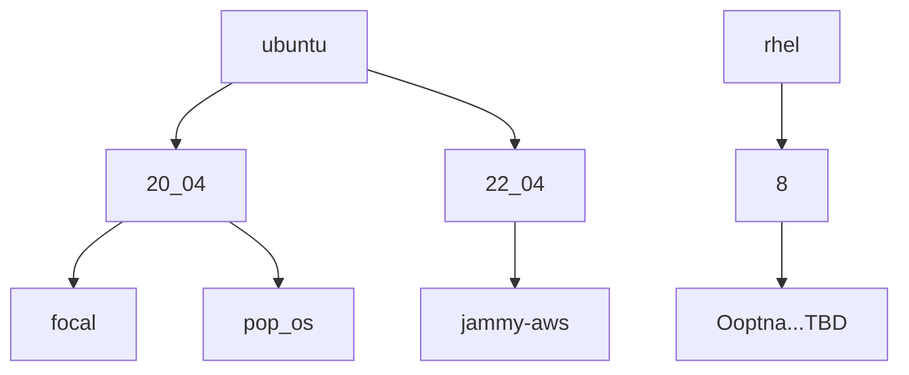

# ALUs-platform
Setup of the supported platforms for ALUs

Each platform is organized into a container/upstream OS. There could be different flavors of same OS. Unders each
destination platform there are different scripts for setting up docker container or host system. Different scripts
could be run in combination where one can choose to either install only runtime needed or full development setup. For
some platforms there could be only NVIDIA driver and libraries' install script supplied.

Example of ubuntu/20_04/focal:
* `Dockerfile`
* `install_nvidia_base.sh`
* `setup_runtime.sh`
* `setup_dev.sh`

Where `setup_runtime.sh` script could be used to install only runtime dependencies. When using it with the combination of
`setup_dev.sh` one could install full development environment for Ubuntu 'Focal Fossa'. Same scripts are referenced by
Dockerfile.

Platforms listed here is not an exhaustive list. For other Linux flavors it is easy to derive dependencies
from the similar distros. Contributions are welcome!

## Overview of the supported platforms

